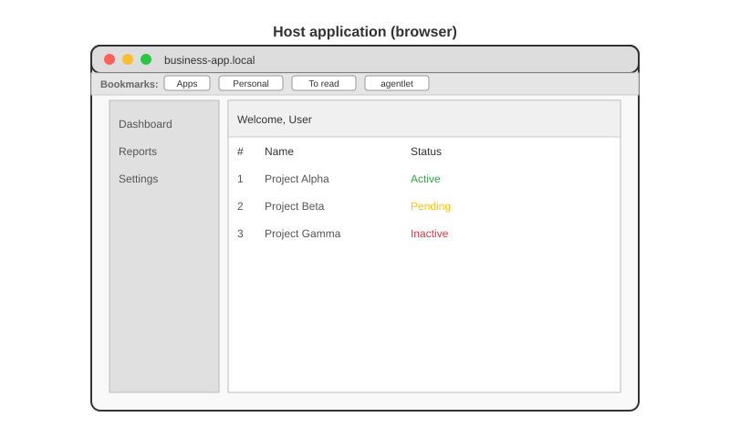
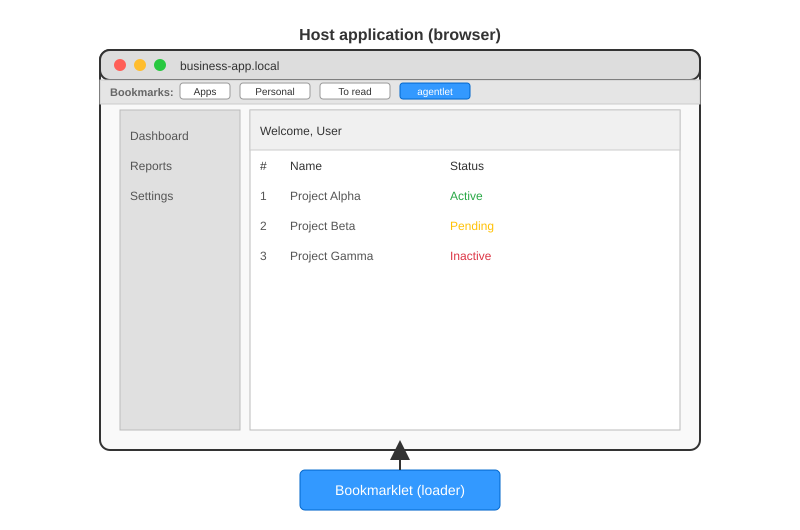
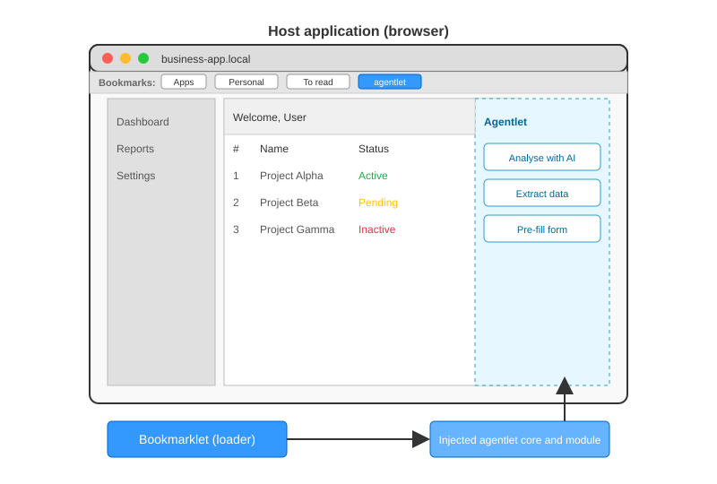
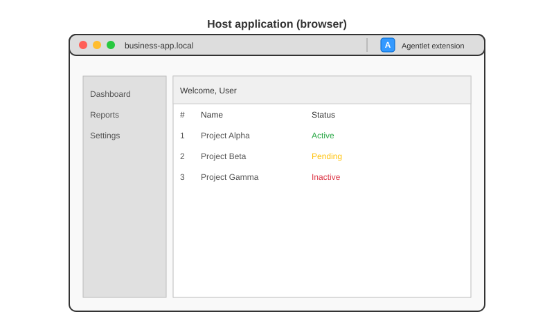
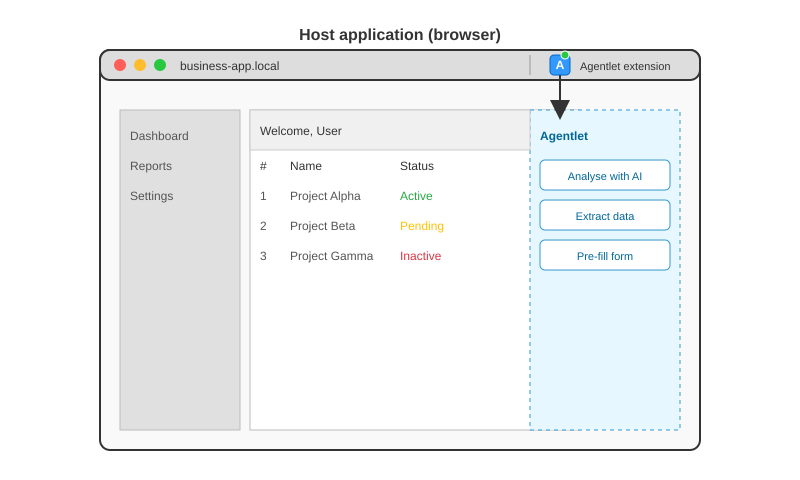

Agentlets integrate directly into the context of an existing webpage, following an unconventional software architecture that developers need to understand. While this approach offers integration advantages, it also introduces specific security considerations, covered in [Security](/docs/concepts/security/).

## Bookmarklet architecture

A bookmarklet is a small JavaScript snippet stored as the URL of a browser bookmark. When you click the bookmark, the browser executes that JavaScript in the context of the currently loaded webpage.

This mechanism lets you interact programmatically with the page's content, modify its behavior, or inject additional functionality, all without installing browser extensions or altering the page's source code.

In technical terms, a bookmarklet works like this:

- The bookmark's `href` starts with `javascript:`, followed by inline JavaScript code.
- When triggered, this code runs within the page's JavaScript environment, as if you ran it in the developer console.
- For small tasks, the bookmarklet's inline code may be sufficient. Try creating a browser bookmark whose URL is `javascript:alert('Hello world!');`.
- For more complex functionality, the bookmarklet typically injects an external script by dynamically creating a `<script>` tag pointing to a remote JavaScript file. This comes with some security constraints, but lets you load larger codebases without exceeding the size limits or encoding constraints of the bookmarklet itself.
- With some additional constraints, the injected code can in turn call APIs to augment the current page with additional capabilities.

Technical constraints to be aware of:

- Bookmarklet code must be URL-encoded, which can make long or complex scripts cumbersome.
- Modern browsers typically impose security restrictions, such as blocking cross-origin requests or mixed-content loading.
- Since the code runs in the context of the current page, it can interact with page elements but also inherits any JavaScript quirks or conflicts from that environment.
- Loading external scripts depends on network availability and correct CORS headers.
- The bookmarklet's injected code only lives in memory for the current page session. A full page reload (F5 or Ctrl-R) resets the page and clears any injected scripts. You need to activate the bookmarklet again. In many modern single page applications (SPAs), navigation between views happens without a full reload, so the injected code can persist across in-app navigation as long as the page is not fully refreshed.

In short, bookmarklets offer a lightweight, extension-free way to enhance or manipulate web pages on the fly, but they operate under technical limitations that developers should design around.

To help navigate these constraints, the agentlet framework provides build scripts that package JavaScript code appropriately, generate both the bookmarklet link and the external script to be injected, and offer components for persistent storage within the page context, allowing agentlets to maintain state across interactions.

## Browser extensions vs bookmarklets

Browser extensions are installable software modules that extend the capabilities of web browsers. Unlike bookmarklets, which run as one-off JavaScript snippets injected into the current page, extensions integrate directly with the browser, giving them access to specialized browser APIs and persistent background scripts.

Some key differences between browser extensions and bookmarklets:

- **Capabilities**: extensions can access privileged APIs (tabs, storage, cookies, `webRequest`), run background scripts, inject content scripts automatically across specified sites, and display UI elements such as toolbar buttons or popups. Bookmarklets are limited to running JavaScript in the context of the current page, only when manually triggered.

- **Persistence**: extensions can maintain persistent state and behavior across browsing sessions. Bookmarklet-injected code only lives until the page is reloaded or navigated away from, though SPAs may allow it to linger across internal navigation.

- **Deployment and distribution**: bookmarklets require no installation, they are just links the user can add to their bookmarks bar. Extensions require packaging, signing, and distribution through browser extension stores such as the Chrome Web Store or Firefox Add-ons, which can introduce approval, update, and security constraints.

- **Security context**: extensions operate in a sandboxed, privileged context separate from the webpage, reducing some risks of interference but also introducing complexity in message passing between extension scripts and page scripts.

Moving from a bookmarklet to an extension is often a natural evolution when the injected code grows beyond the bookmarklet's technical limits, for example needing persistent background behavior, access to browser-level data, automatic injection on specific sites, or a richer user interface. It also means adopting additional tooling, build steps, and maintenance overhead, including keeping up with browser API changes and store policies.

The agentlet framework provides build mechanisms to transform a bookmarklet into a browser extension, making it easier to scale from simple page injections to fully integrated browser tooling when needed.

## Native integration architecture

In some cases, the functionality provided by a bookmarklet can be integrated natively into the host website's frontend. This means the same JavaScript code that would normally be injected at runtime by the bookmarklet is instead loaded directly by the website itself, for example by adding a `<script>` tag in the page template or dynamically loading the agentlet bundle.

This approach is especially useful in environments where deploying new backend features is cumbersome or slow, but adding or updating frontend assets is simpler, such as in many corporate or internal applications. By distributing agentlet functionality as part of the frontend, teams can provide advanced, modular capabilities without requiring backend deployments, API changes, or server updates, effectively graduating a bookmarklet-based feature into a natively integrated frontend component.

## UI isolation and the module mount API

By default, the agentlet panel, dialogs, and toasts mount inside an isolated shadow root, so the host page's CSS cannot reach in and the framework's CSS cannot leak out. See [Shadow DOM](/docs/guides/shadow-dom/).

Alongside the `initModule`/`activateModule`/`cleanupModule` hooks, a module can override `mount()`/`unmount()` to attach a UI framework root (React, Lit, or any other) directly into its panel container, instead of only returning an HTML string. The core never renders agentlet content in a tree of its own, so two agentlets can use two different frameworks, or two copies of the same one, on the same page without interfering. See [Mount API](/docs/guides/mount-api/).

Source: agentlet-core README.md, section "Architecture".
